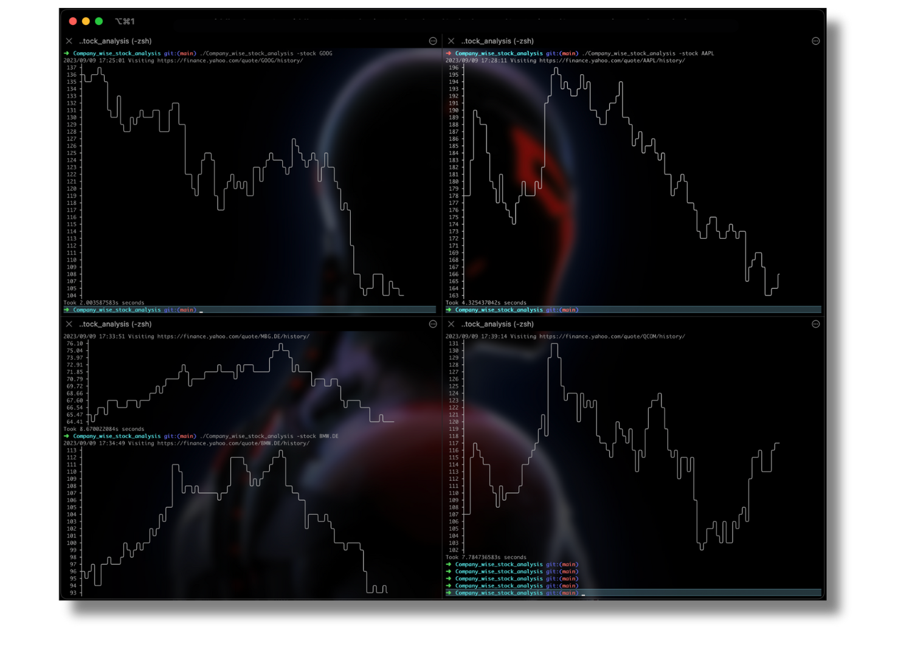

<h1 align="center">
    
    &nbsp;&nbsp;&nbsp;
    
    <br>
    Company-wise Stock Analysis using Go
</h1>

<p align="center">
    <!-- Shields.io badges -->
    
    
</p>

---

## Project Briefing

This Go-based project allows you to analyze company-wise historical stock data from Yahoo Finance. It features web scraping with the `github.com/gocolly/colly` library and ASCII graph visualization using `github.com/guptarohit/asciigraph`.

---

## Table of Contents

- [Screenshots](#screenshots)
- [Features](#features)
- [How to Use](#how-to-use)
- [Dependencies](#dependencies)
- [Further Usage](#further-usage)
- [License](#license)

---

## Screenshots

<p align="center">
    
</p>

---

## Features

- Fetch and visualize historical stock data.
- Utilize web scraping with Colly.
- Create ASCII graphs for stock price trends.

---

## How to Use

1. Clone the repository:

   ```bash
   git clone https://github.com/samriddha-basu-cloud/Company_wise_stock_analysis_using_go.git
   cd Company_wise_stock_analysis_using_go
   ```

2. Build the project:

   ```bash
   go build
   ```

3. Install project dependencies:

   ```bash
   go get github.com/gocolly/colly
   go get github.com/guptarohit/asciigraph
   ```

4. Run the program:

   ```bash
   ./Company_wise_stock_analysis_using_go -stock STOCK_SYMBOL
   ```

---

## Dependencies

This project relies on the following Go packages:

- [Colly](https://github.com/gocolly/colly)
- [Asciigraph](https://github.com/guptarohit/asciigraph)

Install them using `go get`.

---

## Further Usage

Feel free to extend this project for more advanced stock analysis or integrate it with other financial data sources. Contributions are welcome!

---

## License

This project is currently not under any specific license. You may use, modify, and distribute it as per your requirements. Please consider adding an appropriate license in the future.

---

Happy Stock Analysis! 📈
